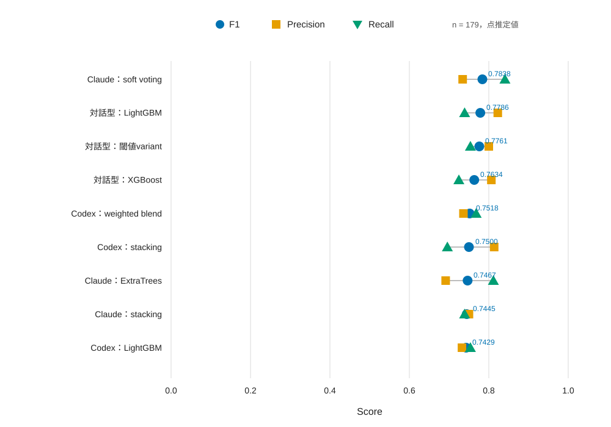
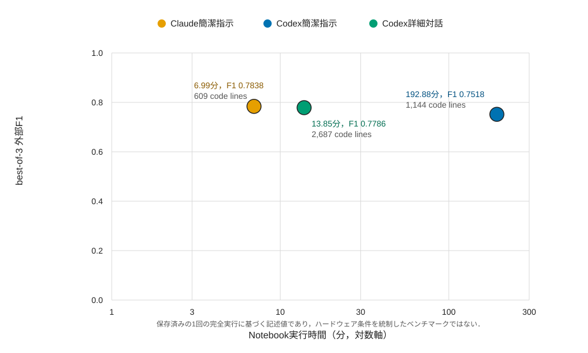

# AIコーディングエージェントによるTitanic予測コードの比較と考察

## 1．目的

本資料では，第8回Python SeminarのTitanic生存予測課題に対して作成された次の3系統のコードを比較する．

| 比較条件 | ディレクトリ | 作成条件 |
| --- | --- | --- |
| Claude簡潔指示 | [`claude-code_code`](./claude-code_code/) | Claude Codeへ課題を簡潔に指示して作成 |
| Codex簡潔指示 | [`codex_code`](./codex_code/) | Codexへ課題を簡潔に指示して作成 |
| Codex詳細対話 | [`self_code`](./self_code/) | ユーザーがCodexへ詳細な要求を伝え，対話と修正を繰り返して作成 |

比較の主眼は，外部testに対するF1だけではない．特徴量設計，モデル探索，検証方法，計算量，データリーク対策，再現性，説明性，提出案の多様性，ユーザーとの対話が成果物へ与えた影響を併せて評価する．

3条件の元プロンプト全文と全対話ログは各ディレクトリに保存されていない．したがって，作成条件の分類はユーザーの説明に基づく．また，以下の評価は2026年7月17日時点の現行ファイルを対象とする．

## 2．評価方法と比較上の注意

### 2.1 データと正式指標

3ディレクトリの `train_titanic.csv`，`test_titanic.csv`，`test_titanic_with-answer.csv` は，それぞれSHA-256が一致している．したがって，データの違いによる有利・不利はない．課題条件は [`lesson8_regulation.md`](./lesson8_regulation.md) に従い，学習712件，test 179件，生存者を正例としたF1を正式指標とする．testの正解は生存69件，死亡110件である．

各提出CSVは `PassengerId` で正解データと照合し，F1，Precision，Recall，Accuracy，混同行列を再計算した．混同行列は `[[TN, FP], [FN, TP]]` の順で記載する．9提出すべてが179行，`PassengerId,Survived` の2列，重複・欠損なし，整数0／1という提出条件を満たした．

### 2.2 OOFと事後評価の区別

OOFは学習データ内でモデルや閾値を選ぶための検証値である．一方，本資料の「外部F1」は，正解配布後に `test_titanic_with-answer.csv` を用いて計算した事後評価である．外部F1はモデル作成時に使用されていないことを本体notebookの入力ファイルから確認した．

### 2.3 統計的な限界

エージェントによるコード生成は各条件1例だけである．179人を統計単位としてモデル予測の誤差を比較することはできても，179人を「エージェント生成の179回の反復」と見なすことはできない．そのため，本資料ではエージェント間の有意差検定や一般的な優劣の断定を行わない．図の点も1つの固定testに対する点推定値であり，独立した複数生成runの誤差棒ではない．

## 3．結論の要約

各系統で外部F1が最も高い提出を比較すると，次の結果となった．

| 条件 | 代表提出 | F1 | Precision | Recall | Accuracy | 実行時間 | コード行数 |
| --- | --- | ---: | ---: | ---: | ---: | ---: | ---: |
| Claude簡潔指示 | Soft voting | **0.7838** | 0.7342 | **0.8406** | 0.8212 | 6.99分 | 609 |
| Codex詳細対話 | LightGBM | 0.7786 | **0.8226** | 0.7391 | **0.8380** | 13.85分 | 2,687 |
| Codex簡潔指示 | Weighted blend | 0.7518 | 0.7361 | 0.7681 | 0.8045 | 192.88分 | 1,144 |

正式指標F1ではClaude簡潔指示版が首位である．一方，Codex詳細対話版はPrecisionとAccuracyが首位であり，死亡者を生存と誤る件数を抑えた．Claude版と詳細対話版のF1差は0.0052で，予測方針の違いに比べて小さい．Codex簡潔指示版に対しては，Claude版が0.0320，詳細対話版が0.0269高かった．

この結果から直接いえることは，「今回保存された成果物では，Claude版のsoft votingが最も高いF1を得た」という事実である．「Claude Codeは一般にCodexより計画能力が高い」とまではいえない．プロンプト，対話量，探索予算，実装方針が同時に異なり，条件ごとの独立反復もないためである．

## 4．全提出の外部評価

| 条件 | 提出方法 | F1 | Precision | Recall | Accuracy | 混同行列 | 生存予測数 |
| --- | --- | ---: | ---: | ---: | ---: | --- | ---: |
| Claude簡潔指示 | Soft voting | **0.7838** | 0.7342 | **0.8406** | 0.8212 | `[[89, 21], [11, 58]]` | 79 |
| Claude簡潔指示 | ExtraTrees | 0.7467 | 0.6914 | 0.8116 | 0.7877 | `[[85, 25], [13, 56]]` | 81 |
| Claude簡潔指示 | Stacking | 0.7445 | 0.7500 | 0.7391 | 0.8045 | `[[93, 17], [18, 51]]` | 68 |
| Codex簡潔指示 | Weighted blend | 0.7518 | 0.7361 | 0.7681 | 0.8045 | `[[91, 19], [16, 53]]` | 72 |
| Codex簡潔指示 | Cross-fit stacking | 0.7500 | 0.8136 | 0.6957 | 0.8212 | `[[99, 11], [21, 48]]` | 59 |
| Codex簡潔指示 | LightGBM | 0.7429 | 0.7324 | 0.7536 | 0.7989 | `[[91, 19], [17, 52]]` | 71 |
| Codex詳細対話 | LightGBM | 0.7786 | **0.8226** | 0.7391 | **0.8380** | `[[99, 11], [18, 51]]` | 62 |
| Codex詳細対話 | 閾値variant | 0.7761 | 0.8000 | 0.7536 | 0.8324 | `[[97, 13], [17, 52]]` | 65 |
| Codex詳細対話 | XGBoost | 0.7634 | 0.8065 | 0.7246 | 0.8268 | `[[98, 12], [19, 50]]` | 62 |

図1．同一の正解付きtest 179件に対する9提出のF1，Precision，Recall．誤差棒がないのは，独立したコード生成runの反復結果ではなく，保存済みの各提出を1回ずつ採点した点推定値だからである．Claude版soft votingはRecallが最も高く，詳細対話版LightGBMはPrecisionが最も高い．この違いが，両者のF1が近いにもかかわらず誤り方が異なる理由である．

## 5．学習内評価と外部評価の差

### 5.1 Claude簡潔指示版

| 方法 | OOF F1 | 外部F1 | 外部－OOF |
| --- | ---: | ---: | ---: |
| Stacking | 0.8059 | 0.7445 | -0.0614 |
| Soft voting | 0.8014 | 0.7838 | -0.0176 |
| ExtraTrees | 0.7912 | 0.7467 | -0.0445 |

OOF首位のstackingは外部testで3提出中最下位となり，OOF 2位のsoft votingが外部F1首位となった．soft votingはOOFからの低下が最小であり，今回のtestに対して最も頑健であった．

### 5.2 Codex簡潔指示版

| 方法 | 最終OOF F1 | 外部F1 | 外部－最終OOF |
| --- | ---: | ---: | ---: |
| LightGBM | 0.8115 | 0.7429 | -0.0686 |
| Weighted blend | 0.8075 | 0.7518 | -0.0557 |
| Cross-fit stacking | 0.8098 | 0.7500 | -0.0598 |

最終OOFは全train上でモデル，パラメータ，重み，閾値を選択した後の値であり，selection-inclusiveな楽観性を含む．一方，探索込み手順を分離して評価したNested CV外側F1は，weighted blend 0.7891，stacking 0.7834，best single選択手順 0.7713であった．Nested CVがweighted blendを最上位とした順位は外部testでも維持されたが，絶対値は0.0373低下した．

### 5.3 Codex詳細対話版

| 方法 | OOF F1 | 外部F1 | 外部－OOF |
| --- | ---: | ---: | ---: |
| LightGBM | 0.8115 | 0.7786 | -0.0329 |
| XGBoost | 0.8079 | 0.7634 | -0.0445 |
| LightGBM閾値variant | 比較可能な独立OOF値なし | 0.7761 | 算出しない |

LightGBM閾値variantは，本命LightGBMの確率に対して閾値を0.474から0.444へ下げた提出である．この閾値に対する独立した選択込みOOF値は保存されていないため，本命LightGBMのOOF値を流用して差を計算することはしない．

## 6．コードと実験設計の比較

| 観点 | Claude簡潔指示 | Codex簡潔指示 | Codex詳細対話 |
| --- | --- | --- | --- |
| notebook | `titanic_survival_prediction.ipynb` | `titanic_f1_high_performance.ipynb` | `titanic_f1_competition.ipynb` |
| セル数 | 34 | 24 | 47 |
| コード行数 | 609 | 1,144 | 2,687 |
| 主な特徴 | 42特徴，女性・少年グループ生存率 | 3 profile，家族・ticket target encoding | 14 profileを比較，最終23特徴 |
| モデル | 6モデル | 6モデル | 8モデル |
| 検証 | 反復5-fold OOF | 5-fold×3回のouter Nested CV，inner 4-fold | 3 seed×5-fold OOF |
| 探索 | 候補設定の比較 | Optuna，約1.5万fit | 6モデル×30 trial，複数seed再評価 |
| アンサンブル | stacking，等重みsoft voting | weighted blend，cross-fit stacking | soft voting，ただし提出は主に単一モデル |
| 閾値 | OOF上でplateau選択 | cross-fitted閾値を含む | OOF上で安定域を選択 |
| 追加分析 | 特徴量重要度，WC特徴の簡易ablation | Nested方式比較，予測相関 | 特徴profile，誤分類多様性，AD |
| 実行時間 | 6.99分 | 192.88分 | 13.85分 |
| 既存CSV保護 | 無条件上書き | 内容不一致なら停止 | 内容不一致なら停止 |

図2．保存済みnotebookの完全実行メタデータから得た所要時間と，各条件のbest-of-3外部F1．コード行数も注記した．実行日は異なり，ハードウェア条件を統制したベンチマークではないため，時間は厳密な速度比較ではなく処理規模の目安である．Codex簡潔指示版は他の2実装より大幅に長時間である一方，外部F1は最も低く，この課題では探索量が性能へ比例していない．

## 7．各実装の特性と評価

### 7.1 Claude簡潔指示版

#### 強み

- 氏名からの敬称，家族人数，ticket共有数，客室，運賃，性別と等級の交互作用など，Titanicに適した42特徴を自律的に構築している．
- 同一ticketまたは同姓・同等級の女性・少年の生存率を使う特徴では，学習行自身をleave-one-outで除外し，検証foldには学習foldで得た統計だけを適用している．
- Logistic Regression，Random Forest，ExtraTrees，HistGradientBoosting，LightGBM，XGBoostを比較し，単一モデル，soft voting，stackingという性格の異なる3提出を生成した．
- soft votingは生存者69人中58人を検出し，Recall 0.8406で全9提出中首位となった．特に男性生存者と子どもの検出が他の代表モデルより良かった．
- 約7分の実行で最高外部F1を得ており，今回の成果物では計算効率が最も高い．

#### 弱み

- 公式指標はF1であるが，単一モデルはF1首位のRandom ForestではなくAP首位のExtraTreesを選んでいる．
- stackingは厳密なNested stackingではなく，閾値選択と表示F1にも同じOOF予測を使用するため，OOF 0.8059には選択バイアスが残る．
- WC特徴のablationはseed数と再調整条件が一致せず，F1差0.0056をWC特徴だけの効果とは断定できない．
- OOF予測や探索履歴を別artifactへ保存せず，提出CSVは同名ファイルを無条件で上書きする．`README.md` と実行用 `main.py` もプロジェクト入口として機能していない．

Claude版の成功は，単にモデル数が多いからではない．Titanic固有のグループ特徴と，Recallを高める低めの閾値0.300を使ったsoft votingがtest分割に適合した影響が大きい．抽象的な課題から有効な特徴量，複数モデル，3提出まで一括して構成した点は，今回の事例における自律的な課題分解能力を示している．

### 7.2 Codex簡潔指示版

#### 強み

- 3実装の中で最も厳密な評価計画を持つ．モデルや閾値を選ぶ内側処理と，未使用データで方式全体を評価する外側処理をNested CVで分離している．
- 欠損補完，one-hot encoding，標準化，target encodingをfold内で完結させ，target encodingでは学習行自身を除外している．
- 閾値選択も保持fold以外のOOF予測から決めるcross-fitted方式を持つ．
- 提出CSVは形式を厳密に検査し，既存ファイルと内容が異なる場合に黙って上書きしない．
- Nested CVでweighted blendを首位とした順位が，現行外部testでも維持された．

#### 弱み

- 712件の教材データに対して，outer 5-fold×3回，inner 4-fold，多数のOptuna trial，blend探索，stacking探索を組み合わせ，約1.5万回のfitと192.88分を要した．
- 大きな計算量に対して，最高外部F1は0.7518にとどまった．複雑さが汎化性能へ結び付いていない．
- `OPTUNA_JOBS=4` の並列TPEによりtrial完了順が変わり得る．実際，同じnotebookソースの再実行でblend重み，閾値，提出CSVが変化した．
- Optuna study，完全な採用パラメータ，OOF予測を独立artifactへ保存していないため，再実行後の結果を完全には復元できない．
- `code-note.md` は旧実行の閾値と事後F1を記載しており，現行notebook・CSVと一致しない．現行値はsingle 0.7429，blend 0.7518，stacking 0.7500である．
- `README.md` は空で，`main.py` は雛形のままである．保存セルは前セルのkernel stateへ依存し，kernel reset後の単独実行でエラーになり得る．

この実装を「Codexは計画を立てられなかった証拠」と解釈するのは正確ではない．notebook内には非常に具体的な計画があり，Nested CVも実装されている．問題は計画の欠如ではなく，計画の優先順位である．未知testでF1を高めるという目的に対して，探索の網羅性と形式的な厳密さへ計算資源を過剰配分し，再現性，途中再開，artifact保存，説明文書との同期を十分に詰めていない．「計画は詳細だが，費用対効果と成果物の運用設計が弱い」と表現する方が証拠に合う．

### 7.3 Codex詳細対話版

#### 強み

- 詳細な対話を通じて，14種類の特徴profile，敬称のまとめ方，家族人数区分，8モデル，Optuna，誤分類の多様性，ADまで分析範囲が拡張された．
- 最終的に採用した23特徴は，基本属性，家族，ticket，姓，運賃，客室を体系的に整理している．
- LightGBMはPrecision 0.8226，Accuracy 0.8380で全9提出中首位となり，偽陽性を11件に抑えた．
- 安全なCSV保存，AD結果，モデル別AD性能，提出差分のCSVを残しており，提出後の監査性は他の2実装より高い．
- 2,687行と最も大規模であるが，探索条件を絞ったことで完全実行は13.85分に収まった．

#### 弱み

- 特徴profile，モデル，ハイパーパラメータ，閾値，アンサンブルを同じ712件のOOF上で繰り返し選んでおり，Nested CVではない．
- ADの `Test_AD_Weighted_Score` はtestの説明変数から得たAD内外比率をモデル選択へ使用する．正解ラベルの漏洩ではないが，レギュレーションの「テストデータの情報をモデル選択に漏らしていない」を厳格に読むと不適合である．
- AD加重スコアでもLightGBMが首位であり，XGBoostは「提出1と異なるモデルを残す」ために2位から選ばれた．ADが勝者を変えたわけではない．
- 3提出の予測が異なるのは179人中4人だけであり，AD外12人の予測はすべて同じである．提出枠を3つ使った割に多様性が低い．
- AD選択XGBoostの外部F1は0.7634で，本命LightGBMの0.7786を下回った．今回の保存結果からは，AD追加がF1を改善した証拠は得られない．
- OOF確率，Optuna全履歴，完全な最終設定はnotebook変数にとどまり，別artifactとして保存されない．`code-note.md` にも調整対象モデルに関する一部不一致がある．

詳細対話によって改善したのは，F1だけではない．Codex簡潔指示版と比べ，最高F1は0.0269，Accuracyは0.0335高くなり，計算時間も大幅に短い．さらに，ユーザーが要求した分析，安全な保存，AD，説明が成果物へ反映された．一方，Claude簡潔指示版のF1は超えておらず，ADと提出多様化も期待どおりの効果を示していない．対話は曖昧さを減らして成果物を目的へ近づけるが，追加要求が必ず汎化性能を改善するわけではない．

## 8．誤り方の違い

各条件の外部F1首位提出を属性別に比較した．小さい群を含むため，以下は機構の証明ではなく，今回の179件で起きた誤りを説明する記述値である．

| 部分集団 | 件数／生存者 | Claude soft voting F1 | Codex weighted blend F1 | 詳細対話LightGBM F1 |
| --- | ---: | ---: | ---: | ---: |
| 女性 | 63／46 | 0.8932 | 0.8738 | **0.8980** |
| 男性 | 116／23 | **0.5333** | 0.4211 | 0.4242 |
| 1等客室 | 43／27 | 0.8571 | 0.8276 | **0.8679** |
| 2等客室 | 34／13 | 0.9167 | 0.9167 | 0.9167 |
| 3等客室 | 102／29 | **0.6557** | 0.6102 | 0.6296 |
| 16歳未満 | 16／12 | **1.0000** | 0.9167 | 0.9167 |
| 16歳以上・年齢既知 | 132／47 | **0.7379** | 0.7010 | 0.7356 |
| 年齢欠損 | 31／10 | 0.7619 | **0.8000** | **0.8000** |

Claude版は女性生存者46人を全員検出し，男性生存者も12人検出した．Codex簡潔指示版は男性生存者8人，詳細対話版は7人である．Claude版のF1優位は，偽陽性を少なくしたことではなく，男性，1等客室，3等客室，子どもで生存者の取り逃がしを減らしたことから生じている．

詳細対話版は全体の偽陽性が11件で，Claude版の21件より10件少ない．その代わり，生存者の見逃しは18件で，Claude版の11件より7件多い．したがって，詳細対話版は「死亡と予測したときの保守性」，Claude版は「生存者を拾うRecall」を重視した異なる動作点にある．

## 9．レギュレーション，リーク，再現性

| 観点 | Claude簡潔指示 | Codex簡潔指示 | Codex詳細対話 |
| --- | --- | --- | --- |
| 正解付きtestを本体で参照 | なし | なし | なし |
| `PassengerId` をモデル入力 | なし | なし | なし |
| 前処理をfold内でfit | 実施 | 実施 | 実施 |
| target encodingの自己除外 | 実施 | 実施 | 対象外 |
| 厳密なNested CV | なし | 実施 | なし |
| test説明変数によるモデル選択 | 一部の記述確認のみ | なし | AD比率を提出2選択に使用 |
| 既存提出CSVの上書き防止 | なし | あり | あり |
| 中間OOF・探索履歴の外部保存 | なし | なし | 一部AD結果のみ |
| 現行説明文書との整合 | おおむね整合 | 数値が不一致 | 調整対象の説明に一部不一致 |

3実装とも，正解ラベル，外部データ，LLM推論を予測パイプラインへ持ち込んだ証拠はない．一方，家族や同一ticketの乗客が通常のStratifiedKFoldで別foldに分かれるため，グループ特徴を持つClaude版とCodex簡潔指示版のOOFは，「未知の家族やticket」への一般化性能より楽観的になり得る．これは規約違反ではなく，評価対象の定義に関する注意である．

## 10．総合考察

### 10.1 簡潔な指示から計画する能力

今回のClaude版は，簡潔な課題からTitanic固有の特徴量，リークを抑えたfold処理，6モデル，閾値選択，3提出まで構築し，最高外部F1を得た．この事例は，Claude Codeが抽象的な要求から実用的な方針へ展開できたことを示す．ただし，評価設計はCodex版ほど厳密ではなく，OOF首位のstackingを外部testが支持しなかった．「良い結果を出したこと」と「評価手順が最も厳密であること」は分ける必要がある．

### 10.2 Codexの計画は何が弱かったか

Codex簡潔指示版は計画を立てていないのではなく，計画が過剰であった．Nested CV，Optuna，blend，stackingをすべて盛り込み，評価の網羅性を高めたが，データ712件に対して計算量が大きすぎた．さらに，並列探索の非決定性，statefulな保存セル，中間artifact不足，古い説明文書という運用上の弱点が残った．

したがって，批判すべき点は「計画を立てる能力」そのものではなく，「何を計画から削るか」「最終目的に対してどの検証へ資源を配分するか」「再実行後も成果物を同期できるか」である．

### 10.3 詳細な対話の効果

詳細対話版は，簡潔指示Codex版よりF1，Accuracy，実行効率，成果物の監査性を改善した．これは，ユーザーが特徴量，出力形状，AD，安全な保存などを具体化した効果と考えられる．一方，対話回数の増加はコード量2,687行，14 profile，ADという複雑さも生み，Claude版のF1を超えるには至らなかった．

詳細な対話の価値は，AIを必ず最高得点へ導くことではなく，目的，制約，保存物，検証観点をユーザーの意図へ近づけることにある．F1だけを目的にするなら，追加機能を増やす前に，提出間の予測多様性とOOFから外部testへの低下を監視する方が有効である．

## 11．主張できることとできないこと

### 11.1 根拠を持って主張できること

- 現行9提出の中ではClaude版soft votingがF1 0.7838で首位である．
- 詳細対話版LightGBMはPrecision 0.8226，Accuracy 0.8380で首位である．
- Codex簡潔指示版は最も厳密なNested CVを実装したが，実行時間が最長で外部F1は最も低かった．
- 詳細対話版は簡潔指示Codex版より高い外部F1を得たが，AD追加がF1を改善した証拠はない．
- 3実装すべてに，正解付きtestをモデル作成へ使用した直接的なリークは見つからない．

### 11.2 この比較だけでは主張できないこと

- Claude Codeは一般にCodexより優れている．
- 詳細なプロンプトや対話を増やせば，常にF1が上がる．
- コード行数，モデル数，Optuna trial数を増やせば汎化性能が上がる．
- 0.0052というClaude版と詳細対話版のF1差が，別のデータ分割や独立生成runでも再現する．

## 12．今後の改善案

### 12.1 モデル改善

- Claude版のgroup特徴とsoft votingを基準とし，Codex版のNested外側評価で方式選択を監査する．
- 詳細対話版の安全なartifact保存を取り入れ，OOF予測，Optuna study，完全な最終設定，実行時刻，データhashをCSVまたはJSONへ保存する．
- 3提出はモデル名だけでなく，予測不一致人数と誤りの補完関係を基準に選ぶ．
- ADは提出前のモデル選択に使わず，提出後の信頼性分析として分離する．
- 家族・ticket依存を評価したい場合は，通常のStratifiedKFoldに加えてgroup単位の分割を補助評価として用いる．

### 12.2 AIエージェント比較の改善

エージェント能力をより公平に比較するには，次の条件をそろえる必要がある．

1. Claude CodeとCodexへ同一の初期プロンプトを与える．
2. 実行時間，最大trial数，使用可能モデル，対話回数の予算を固定する．
3. 各条件を複数の独立sessionで生成し，1回の当たり成果物だけを比較しない．
4. test正解を見る前に主要提出を1つ事前登録し，best-of-3と区別する．
5. F1だけでなく，実行時間，再現成功率，リーク，コード量，artifact完全性，ユーザー修正回数も評価する．

## 13．参照ファイル

- 課題規約：[`lesson8_regulation.md`](./lesson8_regulation.md)
- Claude版本体：[`titanic_survival_prediction.ipynb`](./claude-code_code/titanic_survival_prediction.ipynb)
- Claude版解説：[`code-note.md`](./claude-code_code/code-note.md)
- Claude版事後評価：[`answer.ipynb`](./claude-code_code/answer.ipynb)
- Codex簡潔指示版本体：[`titanic_f1_high_performance.ipynb`](./codex_code/titanic_f1_high_performance.ipynb)
- Codex簡潔指示版解説：[`code-note.md`](./codex_code/code-note.md)
- Codex簡潔指示版事後評価：[`answer.ipynb`](./codex_code/answer.ipynb)
- Codex詳細対話版本体：[`titanic_f1_competition.ipynb`](./self_code/titanic_f1_competition.ipynb)
- Codex詳細対話版解説：[`code-note.md`](./self_code/code-note.md)
- Codex詳細対話版事後評価：[`answer.ipynb`](./self_code/answer.ipynb)
- AD別性能：[`model_ad_performance.csv`](./self_code/model_ad_performance.csv)
- 提出差分：[`submission_comparison.csv`](./self_code/submission_comparison.csv)
